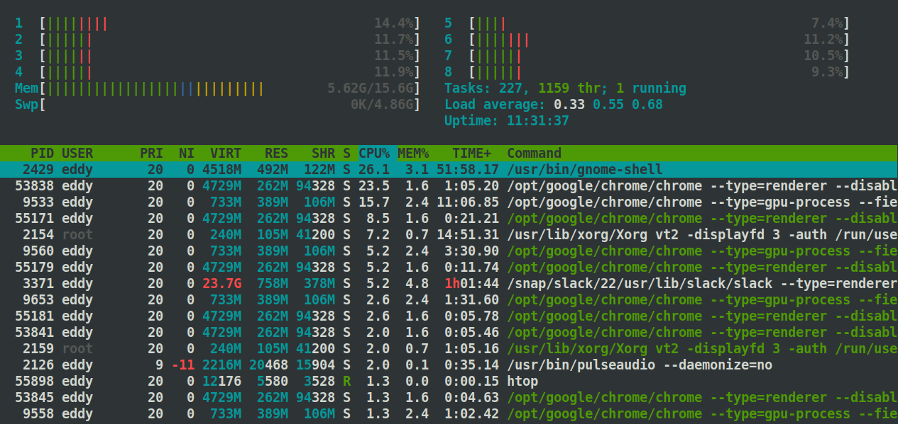

# DevOps Roadmap

Links to resources based on [this roadmap](https://roadmap.sh/devops)

# Table of Contents

- [Learn a programming language](#learn-a-programming-language)
  * [Python](#python)
  * [Ruby](#ruby)
  * [Node.js](#nodejs)
  * [Go](#go)
  * [Rust](#rust)
- [Understand Different OS Concepts](#understand-different-os-concepts)
  * [Process Management](#process-management)
  * [Threads and Concurrenncy](#threads-and-concurrenncy)
  * [Sockets](#sockets)
  * [POSIX Basics](#posix-basics)
  * [Networking Concepts](#networking-concepts)
  * [Startup Management](#startup-management)
  * [Service Management](#service-management)
  * [I/O Management](#i-o-management)
  * [Process Management](#process-management-1)
  * [Memory and Storage](#memory-and-storage)
  * [File Systems](#file-systems)
- [Learn about Managing Servers](#learn-about-managing-servers)
  * [Operating System](#operating-system)
    + [Linux](#linux)
      - [SUSE Linux](#suse-linux)
      - [Debian](#debian)
      - [Fedora](#fedora)
      - [Ubuntu](#ubuntu)
      - [CentOS](#centos)
      - [RHEL](#rhel)
    + [Unix](#unix)
      - [FreeBSD](#freebsd)
      - [OpenBSD](#openbsd)
      - [NetBSD](#netbsd)
    + [Windows](#windows)
  * [Learn to live in Terminal](#learn-to-live-in-terminal)
    + [Terminal Multiplexers](#terminal-multiplexers)
      - [tmux](#tmux)
      - [screen](#screen)
    + [Learn Bash Scripting](#learn-bash-scripting)
    + [Vim/Nano/PowerShell/Emacs](#vim-nano-powershell-emacs)
    + [Compiling apps from source](#compiling-apps-from-source)
    + [System Performance](#system-performance)
    + [Text Manipulation Tools](#text-manipulation-tools)
    + [Process Monitoring](#process-monitoring)
    + [Network](#network)
    + [Others](#others)
- [Networking, Security and Protocols](#networking--security-and-protocols)
  * [Emails](#emails)
    + [SMTP](#smtp)
    + [IMAPS](#imaps)
    + [POP3S](#pop3s)
    + [DMARC](#dmarc)
    + [SPF](#spf)
    + [Domain Keys](#domain-keys)
  * [HTTP](#http)
  * [HTTPS](#https)
  * [FTP](#ftp)
  * [SSL/TLS](#ssl-tls)
  * [SSH](#ssh)
  * [Port Forwarding](#port-forwarding)
- [What is and How to Setup a...](#what-is-and-how-to-setup-a)
  * [Reverse Proxy](#reverse-proxy)
  * [Caching Server](#caching-server)
  * [Forward Proxy](#forward-proxy)
  * [Load Balancer](#load-balancer)
  * [Firewall](#firewall)
  * [Queuing and Streaming Systems](#queuing-and-streaming-systems)
    + [Pub/Sub Model](#pub-sub-model)
    + [Producer/Consumer Model](#producer-consumer-model)
    + [Kafka](#kafka)
    + [RabbitMQ](#rabbitmq)
    + [ActiveMQ](#activemq)
    + [Kinesis (AWS)](#kinesis--aws-)
  * [Web Server](#web-server)
    + [IIS](#iis)
    + [Nginx](#nginx)
    + [Apache](#apache)
    + [Tomcat](#tomcat)
    + [Caddy](#caddy)
- [Learn Infrastructure as Code](#learn-infrastructure-as-code)
  * [Containers](#containers)
    + [Docker](#docker)
    + [LXC](#lxc)
  * [Configuration Management](#configuration-management)
    + [Ansible](#ansible)
    + [Salt](#salt)
    + [Puppet](#puppet)
    + [Chef](#chef)
  * [Container Orchestration](#container-orchestration)
    + [Kubernetes](#kubernetes)
    + [Mesos](#mesos)
    + [Docker Swarm](#docker-swarm)
    + [Nomad](#nomad)
  * [Infrastructure Provisioning](#infrastructure-provisioning)
    + [Terraform](#terraform)
    + [CloudFormation](#cloudformation)
    + [Vagrant](#vagrant)
  * [Service Mesh](#service-mesh)
    + [Istio](#istio)
    + [Envoy](#envoy)
    + [Linkerd](#linkerd)
    + [Consul](#consul)
- [Learn some CI/CD tools](#learn-some-ci-cd-tools)
  * [Gitlab CI](#gitlab-ci)
  * [Github Actions](#github-actions)
  * [Bamboo](#bamboo)
  * [Azure DevOps](#azure-devops)
  * [Jenkins](#jenkins)
  * [Travis CI](#travis-ci)
  * [TeamCity](#teamcity)
  * [Circle CI](#circle-ci)
- [Learn How to Monitor Software and Infrastructure](#learn-how-to-monitor-software-and-infrastructure)
  * [Infrastructure Monitoring](#infrastructure-monitoring)
    + [Prometheus](#prometheus)
    + [Nagios](#nagios)
    + [Grafana](#grafana)
    + [Zabbix](#zabbix)
    + [Monit](#monit)
    + [Datadog](#datadog)
  * [Application Monitoring](#application-monitoring)
    + [Jaeger](#jaeger)
    + [New Relic](#new-relic)
    + [Instana](#instana)
    + [AppDynamics](#appdynamics)
    + [OpenTracing](#opentracing)
  * [Logs Management](#logs-management)
    + [Elastic Stack](#elastic-stack)
    + [Graylog](#graylog)
    + [Splunk](#splunk)
    + [Papertrail](#papertrail)
  * [Chaos Testing](#chaos-testing)
- [Cloud Providers](#cloud-providers)
  * [AWS](#aws)
  * [Google Cloud](#google-cloud)
  * [Azure](#azure)
  * [Heroku](#heroku)
  * [Digital Ocean](#digital-ocean)
  * [Linode](#linode)
  * [Vultr](#vultr)
- [Cloud Design Patterns](#cloud-design-patterns)
  * [Availability](#availability)
  * [Data Management](#data-management)
  * [Design and Implementation](#design-and-implementation)
  * [Management and Monitoring](#management-and-monitoring)

<small><i><a href='http://ecotrust-canada.github.io/markdown-toc/'>Table of contents generated with markdown-toc</a></i></small>

## Learn a programming language

### Python

### Ruby

### Node.js

### Go

### Rust

## Understand Different OS Concepts

### Process Management

### Threads and Concurrenncy

### Sockets

### POSIX Basics

### Networking Concepts

### Startup Management

- [Managing Linux Init/startup scripts](http://www.debianadmin.com/manage-linux-init-or-startup-scripts.html)

### Service Management

### I/O Management

### Process Management

### Memory and Storage

### File Systems

## Learn about Managing Servers

### Operating System

#### Linux

##### SUSE Linux

##### Debian

##### Fedora

##### Ubuntu

##### CentOS

##### RHEL

#### Unix

##### FreeBSD

##### OpenBSD

##### NetBSD

#### Windows

### Learn to live in Terminal

#### Terminal Multiplexers

##### tmux

##### screen

#### Learn Bash Scripting

#### Vim/Nano/PowerShell/Emacs

#### Compiling apps from source

gcc, make

#### System Performance

nmon, iostat, sar, vmstat

#### Text Manipulation Tools

awk, sed, grep, sort, uniq, cat, cut, echo, fmt, tr, nl, egrep, fgrep, wc, jq

#### Process Monitoring

ps, top, htop, atop, lsof

- htop

Example: 

#### Network

nmap, tcpdump, ping, mtr, traceroute, dig, airmon, airodump, dig, iptables, netstat

#### Others

strace, dtrace, systemtap, uname, df, history

## Networking, Security and Protocols

### Emails

#### SMTP

#### IMAPS

#### POP3S

#### DMARC

#### SPF

#### Domain Keys

### HTTP

### HTTPS

### FTP

### SSL/TLS

### SSH

### Port Forwarding

## What is and How to Setup a...

- [Harvard lecture which serves as a good intro](https://www.youtube.com/watch?v=-W9F__D3oY4)

### Reverse Proxy

nginx

### Caching Server

redis, varnish, memcached

### Forward Proxy

### Load Balancer

nginx, haproxy

### Firewall

### Queuing and Streaming Systems

#### Pub/Sub Model

#### Producer/Consumer Model

#### Kafka

#### RabbitMQ

#### ActiveMQ

- [Getting Starting Guides](https://www.rabbitmq.com/getstarted.html)

#### Kinesis (AWS)

### Web Server

#### IIS

#### Nginx

#### Apache

#### Tomcat

#### Caddy

## Learn Infrastructure as Code

### Containers

#### Docker

#### LXC

### Configuration Management

#### Ansible

#### Salt

#### Puppet

#### Chef

### Container Orchestration

#### Kubernetes

#### Mesos

#### Docker Swarm

#### Nomad

### Infrastructure Provisioning

#### Terraform

#### CloudFormation

#### Vagrant

### Service Mesh

#### Istio

#### Envoy

#### Linkerd

#### Consul

## Learn some CI/CD tools

### Gitlab CI

### Github Actions

### Bamboo

### Azure DevOps

### Jenkins

### Travis CI

### TeamCity

### Circle CI

## Learn How to Monitor Software and Infrastructure

### Infrastructure Monitoring

#### Prometheus

#### Nagios

#### Grafana

#### Zabbix

#### Monit

#### Datadog

### Application Monitoring

#### Jaeger

#### New Relic

#### Instana

#### AppDynamics

#### OpenTracing

### Logs Management

#### Elastic Stack

#### Graylog

#### Splunk

#### Papertrail

### Chaos Testing

- [Principals of Chaos Engineering](http://principlesofchaos.org/?lang=ENcontent)

## Cloud Providers

### AWS

### Google Cloud

### Azure

### Heroku

### Digital Ocean

### Linode

### Vultr

## Cloud Design Patterns

### Availability

### Data Management

### Design and Implementation

- [System Design Primer](https://github.com/donnemartin/system-design-primer)

### Management and Monitoring
